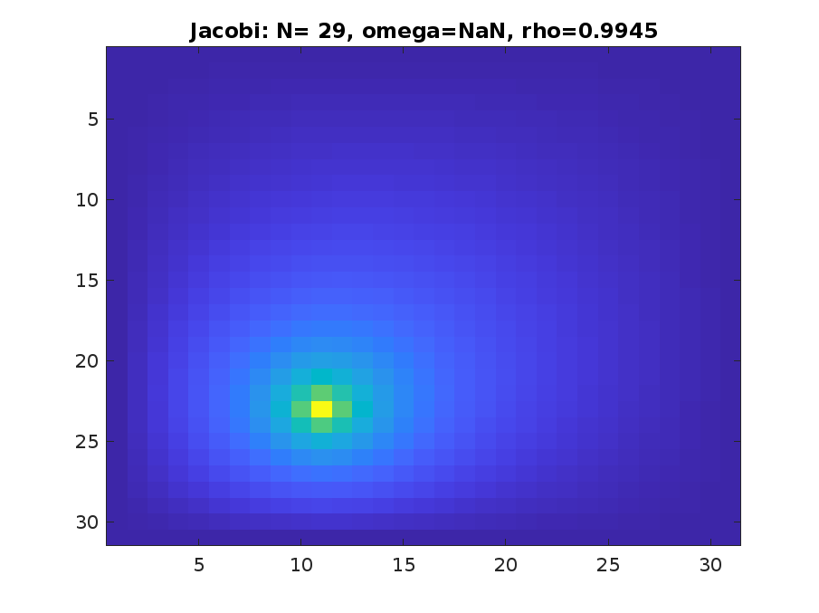

# Poisson Equation Solver in MATLAB


## Overview

This repository contains a MATLAB program to solve the Poisson equation on a square domain $$\Omega = [0, 1] \times [0, 1]$$ with Dirichlet boundary conditions using three iterative methods: **Jacobi**, **Gauss-Seidel**, and **Successive Over-Relaxation (SOR)**. The solution is visualized and verified for correctness, performance, and convergence criteria.

### Problem Definition

We aim to solve the following Poisson problem:
```math
\Delta u(x, y) = f(x, y), \quad 0 \leq x, y \leq 1,
```
with boundary conditions:

```math
\Delta u(x, y) = f(x, y), \quad 0 \leq x, y \leq 1,
```
u(0, y) = u(1, y) = u(x, 0) = u(x, 1) = 0, \quad 0 \leq x, y \leq 1.

### Discretization Approach

The discretized Laplacian operator is approximated as:

```math
\Delta u \approx \frac{u_{i-1, j} + u_{i+1, j} + u_{i, j-1} + u_{i, j+1} - 4u_{i, j}}{h^2},
```
where $$h = \frac{1}{N+1}$$, $$N$$ is the grid size, and $$u_{i, j} = u(ih, jh)$$.

## Features

- **Support for three iterative methods**: Jacobi, Gauss-Seidel, and SOR.
- **Automatic optimization of the relaxation parameter $$\omega$$** for SOR.
- **Vectorized operations for efficient computation**.
- **Sparse matrix representations** to handle large grids with minimal memory usage.
- **Visual output** for solution and convergence behavior.


## Usage

To solve the Poisson equation with a specific method, run the provided `script.m` or use the following code structure:

```matlab
N = 29; % Grid size
omega_guess = []; % Initial guess for omega (used in SOR)
tol = 1e-13; % Convergence tolerance

% Define source term f
f = zeros(N, N);
h = 1 / (N + 1);
f(round(3/4 * N), round(1/3 * N)) = 1 / h^2; % Example point source

% Solve using the desired method
[u, omega, rho, A] = solve_poisson(f, 'Method', 'SOR', 'Omega', omega_guess, 'Tolerance', tol);
```

## Implementation Details

### Functions Included

- **`solve_poisson.m`**: Main function to solve the Poisson equation.
- **`build_matrix.m`**: Constructs the sparse coefficient matrix $$A$$ for the Poisson equation.
- **`jacobi.m`**: Implements the Jacobi iterative method.
- **`gauss_seidel.m`**: Implements the Gauss-Seidel iterative method.
- **`sor.m`**: Implements the Successive Over-Relaxation method.
- **`spectral_radius.m`**: Calculates the spectral radius of a matrix to check convergence.
- **`TEST.m`**: Script to run tests and validate the implementation and convergence of the iterative methods.

### Visualizations

The script generates visual outputs, including:
- The solution matrix $$u$$ as a 2D plot.
- Quiver plots to show the gradient field.
- Reordered sparse matrix visualizations (Cuthill-McKee and AMD).

## Examples

### Jacobi Method (Grid Size 29)



### SOR Method with Optimal $$\omega$$ (Grid Size 49)


## Applications

This project demonstrates proficiency in:
- **Numerical methods** for partial differential equations.
- **Efficient use of MATLAB** for scientific computing.
- **Sparse matrix handling** for large-scale problems.

## Potential for Future Work

The project can be expanded to include:
- Adaptive grid refinements.
- Non-uniform source terms and more complex boundary conditions.
- Performance analysis and comparisons of iterative methods.

## About

**Author**: Joel Amir Dario Maldonado Tänori  
**Date**: October 2024  
**Contact**: [Email](mailto:yourname@domain.com)

## License

This project is licensed under the MIT License. See the [LICENSE](LICENSE) file for more details.

---

## Connect With Me

I am passionate about numerical methods, algorithm development, and applied mathematics. If you're interested in collaborating or have questions, please reach out or check out my other projects.
